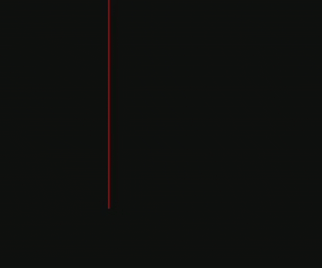

# Physics Engine

This document covers the collision detection and ball dynamics system.

---

## Overview

The physics engine handles:

1. **Ball-wall collisions** – Boundary reflections

2. **Ball-paddle collisions** – Player interactions

3. **Ball-ball collisions** – Multi-ball dynamics with predictive detection

---

## Demo



---

## Ball Dynamics

### Ball Entity

Each ball maintains position, velocity, and radius:

```python
class Ball:
    def __init__(self, x, y, velocity, DT):
        self.x = x
        self.y = y
        self.velocity = velocity  # [vx, vy]
        self.radius = 15
        self.DT = DT  # Time step
        
    def update(self):
        self.x += self.velocity[0] * self.DT
        self.y += self.velocity[1] * self.DT
```

### Ball Spawning

Balls spawn with randomized initial conditions:

```python
x = random(screen_width/4, 3*screen_width/4)
y = random(0, screen_height)
vx = random_sign() * random(150, 200)  # px/s
vy = random_sign() * random(50, 100)   # px/s
```

---

## Collision Detection

### Wall Collisions

Simple boundary checks with velocity reflection:

```python
# Top/bottom walls
if ball.y - ball.radius <= 0 or ball.y + ball.radius >= screen_height:
    ball.velocity[1] = -ball.velocity[1]
```

### Paddle Collisions

Paddle collisions check if the ball edge intersects the paddle rectangle:

```python
if (ball_left < paddle.x + paddle.width and 
    ball_left > paddle.x and 
    paddle.y < ball.y < paddle.y + paddle.height):
    ball.velocity[0] = -1.1 * ball.velocity[0]  # Speed increase
```

The `1.1` multiplier increases horizontal speed on each hit, creating progressive difficulty.

### Scoring

Ball exits left/right boundaries award points:

```python
if ball.x - ball.radius <= 0:
    playerB["score"] += 1
    balls.remove(ball)
elif ball.x + ball.radius >= screen_width:
    playerA["score"] += 1
    balls.remove(ball)
```

---

## Ball-Ball Collisions

The `CollisionManager` implements **predictive collision detection** using analytical time-of-impact calculations.

### Algorithm Overview

1. **Predict collision times** for all ball pairs

2. **Store events** in a min-heap (priority queue)

3. **Process events** in chronological order

4. **Apply elastic collision** response

### Collision Time Calculation

Given two balls with positions $\mathbf{p}_1, \mathbf{p}_2$ and velocities $\mathbf{v}_1, \mathbf{v}_2$:

$$
\mathbf{d} = \mathbf{p}_2 - \mathbf{p}_1, \quad \mathbf{dv} = \mathbf{v}_2 - \mathbf{v}_1
$$

Collision occurs when distance equals sum of radii:

$$
|\mathbf{d} + t \cdot \mathbf{dv}|^2 = (r_1 + r_2)^2
$$

Expanding yields a quadratic in $t$:

$$
at^2 + bt + c = 0
$$

Where:

- $a = |\mathbf{dv}|^2$

- $b = 2(\mathbf{d} \cdot \mathbf{dv})$

- $c = |\mathbf{d}|^2 - (r_1 + r_2)^2$

```python
def compute_collision_time(self, ball1, ball2):
    dx = ball2.x - ball1.x
    dy = ball2.y - ball1.y
    dvx = ball2.velocity[0] - ball1.velocity[0]
    dvy = ball2.velocity[1] - ball1.velocity[1]
    
    a = dvx**2 + dvy**2
    b = 2 * (dx * dvx + dy * dvy)
    c = dx**2 + dy**2 - (ball1.radius + ball2.radius)**2
    
    disc = b**2 - 4*a*c
    if disc < 0:
        return math.inf  # No collision
    
    t1 = (-b - sqrt(disc)) / (2*a)
    t2 = (-b + sqrt(disc)) / (2*a)
    
    # Return smallest positive time
    return min(t for t in [t1, t2] if t > 0)
```

### Elastic Collision Response

For equal-mass balls with restitution coefficient $e = 1$ (fully elastic):

```python
def handle_ball_ball_collision(self, ball1, ball2):
    # Normal vector
    dx, dy = ball2.x - ball1.x, ball2.y - ball1.y
    dist = math.hypot(dx, dy)
    nx, ny = dx/dist, dy/dist
    
    # Relative velocity along normal
    dvx = ball1.velocity[0] - ball2.velocity[0]
    dvy = ball1.velocity[1] - ball2.velocity[1]
    impact_speed = dvx * nx + dvy * ny
    
    # Impulse (equal masses)
    impulse = -(1 + self.restitution) * impact_speed / 2
    
    # Apply impulse
    ball1.velocity[0] += impulse * nx
    ball1.velocity[1] += impulse * ny
    ball2.velocity[0] -= impulse * nx
    ball2.velocity[1] -= impulse * ny
```

### Positional Correction

Prevents balls from overlapping after collision:

```python
penetration = (ball1.radius + ball2.radius) - distance
if penetration > 0:
    ball1.x -= penetration * nx
    ball1.y -= penetration * ny
    ball2.x += penetration * nx
    ball2.y += penetration * ny
```

---

## Event-Driven Simulation

### Min-Heap Priority Queue

Events are stored in a min-heap ordered by collision time:

```python
def populate_next_events(self):
    self.collision_heap = []
    
    for i, j in combinations(range(len(self.balls)), 2):
        event = self.compute_collision_event(balls[i], balls[j])
        if event:
            heapq.heappush(self.collision_heap, event)
    
    self.next_event = self.collision_heap[0] if self.collision_heap else None
```

### Processing Collisions

Each frame, the manager checks if the next event occurs within the time step:

```python
def process_collisions(self, dt):
    if self.next_event is None:
        for ball in self.balls:
            ball.update()
        return
    
    if self.next_event[0] > dt:
        # Collision happens later, just decrement time
        self.next_event[0] -= dt
    else:
        # Collision happens this frame
        self.handle_ball_ball_collision(ball1, ball2)
    
    for ball in self.balls:
        ball.update()
    
    self.populate_next_events()  # Recalculate for next frame
```

---

## Performance Considerations

| Approach | Complexity | Notes |
|----------|------------|-------|
| Naive pairwise | O(n²) per frame | Checks all pairs every frame |
| **Event-driven** | O(n² log n) amortized | Only recalculates on collision |
| Spatial partitioning | O(n log n) | Overkill for small n |

For typical gameplay (4-10 balls), event-driven approach provides optimal performance.
